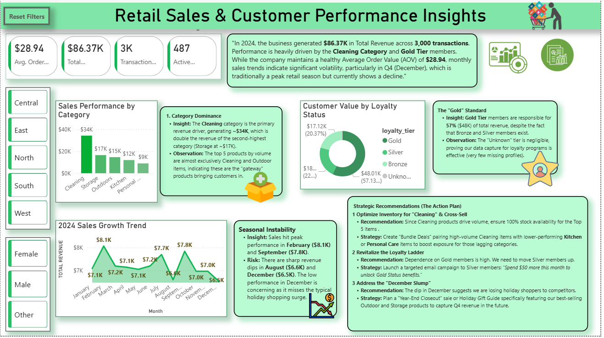

# Retail Sales & Customer Performance Insights 📊

*(Replace this text with your actual dashboard screenshot link)*

## 📖 Project Overview
This project is an end-to-end data analysis solution designed to help a retail business understand its sales performance and customer demographics. 

Starting with a raw dataset containing data quality issues (inconsistent text,and missing values), I used **MS SQL Server** to clean and standardize the data. Then i performed Exploratory Data Analysis (EDA) using SQL to uncover trends. Finally, I built an interactive **Power BI** dashboard to visualize KPIs and provide actionable business recommendations.

## ❓ Business Problem
The stakeholders wanted to answer four key questions to improve profitability:
1.  **Sales Trends:** How is revenue performing month-over-month?
2.  **Customer Value:** Who are the high-value customers, and does the Loyalty Program actually drive revenue?
3.  **Product Performance:** Which categories are driving the business, and which are lagging?
4.  **Operational Insights:** How can inventory and marketing be optimized based on purchasing behavior?

## 🛠️ Tech Stack
* **Database:** Microsoft SQL Server (SSMS)
* **Cleaning & EDA:** SQL (T-SQL)
* **Visualization:** Microsoft Power BI
* **Data Source:** [Kaggle: Sales & Customer Behaviour Insights](https://www.kaggle.com/datasets/ajinkyachintawar/sales-and-customer-behaviour-insights)

---

## ⚙️ Methodology & Workflow

### Phase 1: Data Cleaning & Transformation (SQL)
The raw data required significant cleaning before analysis could begin.
* **Standardized Categorical Data:** Used `CASE` statements and `UPPER()`/`TRIM()` functions to fix inconsistent entries in the `gender` (e.g., 'femle' -> 'Female') and `loyalty_tier` columns.
* **Handled NULL Values:** Replaced missing region and tier data with 'Unknown' using `ISNULL()` to ensure accurate reporting.

### Phase 2: Exploratory Data Analysis (SQL)
Executed 14 SQL queries to extract key metrics, including:
* Total Revenue, Average Order Value (AOV), and Total Transactions.
* Revenue breakdown by Region and Loyalty Tier.
* Top 5 Customers by total spend.
* Market Basket Analysis assumptions based on customer purchase history.

### Phase 3: Data Visualization (Power BI)
Built a 2-page interactive dashboard:
* **Data Modeling:** Established a Star Schema connecting the Fact Table (`sales_data`) to Dimension Tables (`customer_info`, `product_info`) and a dedicated `Date Table`.
* **DAX Measures:** Created explicit measures for `Total Revenue`, `AOV`, `Transaction Count`, and `Active Customers`.
* **Interactivity:** Implemented Slicers (Region, gender) and a **"Reset Filters" Bookmark** for better user experience.
* **Strategic Insights Page:** Dedicated a second page to interpret the data and offer business recommendations.

---

## 💡 Key Insights & Recommendations

### 1. Revenue Drivers
* **Insight:** The **Cleaning** category is the top performer, generating **2x more revenue** than the second-best category (Storage).
* **Recommendation:** Prioritize inventory stocking for top Cleaning products to prevent stockouts.

### 2. Customer Loyalty
* **Insight:** **Gold Tier** members contribute **57% of total revenue**, validating the importance of the loyalty program.
* **Recommendation:** Launch a targeted email campaign to 'Silver' members offering incentives to upgrade to 'Gold'.

### 3. Seasonality Risks
* **Insight:** Sales show significant volatility, with a noticeable dip in **December ($6.5K)** compared to the peak in February ($8.1K).
* **Recommendation:** Implement a "Year-End Closeout" sale to capture missed Q4 revenue opportunities.

---

## 📸 Dashboard Screenshots

### Page 1: Interactive Dashboard

*Interactive view allowing users to filter by Region, Date, and Demographics.*

### Page 2: Strategic Insights

*Executive summary highlighting key findings and actionable business steps.*

---

## 📂 Repository Structure
* `Data/`: Contains the raw CSV files (optional).
* `SQL_Scripts/`:
    * `1_Data_Cleaning SQL Script.sql`: Scripts used to fix typos, NULLs, and randomize dates.
    * `2_EDA_SQL Script.sql`: The 14 business questions answered via SQL.
* `PowerBI/`:
    * `Dashboard.pbix`: The final dashboard file.
    * 'Dashboard.png' : Dashboard Screenshot
* `README.md`: Project documentation.

## 🚀 How to Run
1.  **SQL Setup:** Import data, Run the `1_Data_Cleaning.sql` script in MS SQL Server to create the database and tables.
2.  **Power BI:** Open the `.pbix` file. Ensure the data source settings point to your local SQL Server instance.
3.  **Interact:** Use the slicers on Page 1 to explore the data.

---

**Author:** Harshraj Suryawanshi 
**LinkedIn:** www.linkedin.com/in/harshrajanalyst

